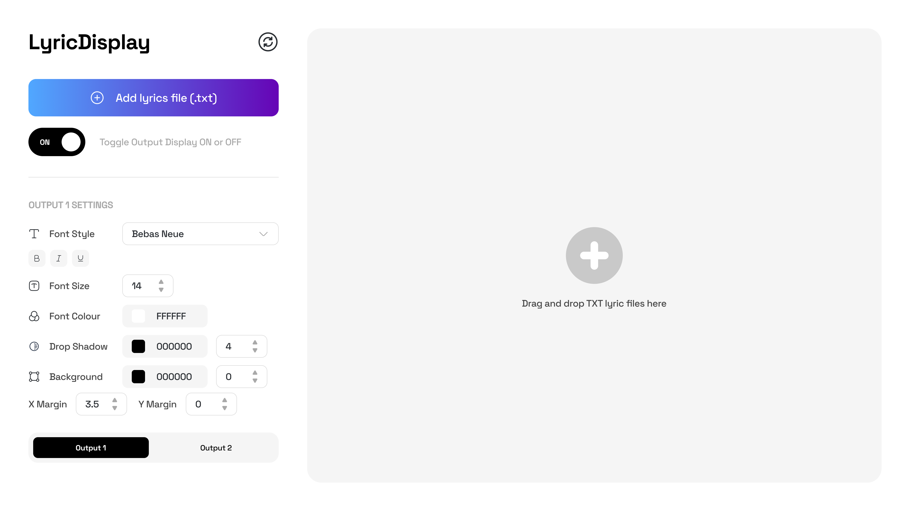

# LyricDisplay App

A real-time, multi-output lyric display system with a web-based control panel. Built with React, Vite, Express, and Socket.io, and optionally packaged as a desktop app with Electron. Designed for live performances, streaming, and presentations where dynamic lyric control and display are required.

---

## Table of Contents
- [Project Overview](#project-overview)
- [Features](#features)
- [Architecture](#architecture)
- [Screenshots](#screenshots)
- [Getting Started](#getting-started)
- [Usage](#usage)
- [Configuration](#configuration)
- [Folder Structure](#folder-structure)
- [Technologies Used](#technologies-used)
- [Contributing](#contributing)
- [License](#license)
- [Contact](#contact)

---

## Project Overview
LyricDisplay enables real-time control and display of song lyrics across multiple output screens. The system consists of a web-based control panel for managing lyrics and one or more output pages for displaying lyrics to an audience. Communication between the control panel and output screens is handled via WebSockets (Socket.io).

---

## Features
- Real-time lyric updates across multiple output screens
- Web-based control panel for managing lyrics and settings
- Multiple output pages (e.g., Output1, Output2) for different displays
- Customizable output settings (font, color, etc.)
- Responsive, modern UI using Radix UI and Tailwind CSS
- State management with Zustand
- Backend server with Express and Socket.io
- Electron packaging for desktop deployment

---

## Architecture
- **Frontend:** React (Vite), Zustand, Radix UI, Tailwind CSS
- **Backend:** Node.js, Express, Socket.io
- **Desktop:** Electron (optional)
- **Communication:** WebSockets for real-time updates

---

## Screenshots
<!-- Add screenshots to docs/screenshots/ and update the paths below -->



---

## Getting Started

### Prerequisites
- [Node.js](https://nodejs.org/) (v16 or higher recommended)
- [npm](https://www.npmjs.com/) or [yarn](https://yarnpkg.com/)

### Installation
1. Clone the repository:
   ```sh
   git clone https://github.com/PeterAlaks/lyric-display-app.git
   cd lyric-display-app
   ```
2. Install dependencies for both the main app and backend server:
   ```sh
   npm install
   cd server && npm install && cd ..
   ```

---

## Usage

### Development
Start the frontend and backend in separate terminals:
```sh
# Terminal 1: Start the frontend (Vite)
npm run dev

# Terminal 2: Start the backend server
npm run server
```
- The frontend will be available at [http://localhost:5173](http://localhost:5173)
- The backend server will run on the port specified in `.env` (default: 3001)

### Production Build
To build the frontend for production:
```sh
npm run build
```
To preview the production build:
```sh
npm run preview
```

### Electron Desktop App
To run in Electron (development):
```sh
npm run electron-dev
```
To package as a desktop app:
```sh
npm run electron-pack
```

---

## Configuration
- Environment variables can be set in a `.env` file in the project root.
- Example variables:
  ```env
  VITE_API_URL=http://localhost:3001
  PORT=3001
  ```
- The backend server also supports a `.env` file in the `server/` directory.

---

## Folder Structure
```
lyric-display-app/
├── public/                # Static assets
├── src/
│   ├── components/        # UI components (LyricDisplayApp, LyricsList, OutputSettingsPanel, etc.)
│   ├── context/           # Zustand store (LyricsStore.js)
│   ├── hooks/             # Custom hooks (useSocket, useFileUpload)
│   ├── lib/               # Utility libraries
│   ├── pages/             # Main pages (ControlPanel, Output1, Output2)
│   ├── utils/             # Utility functions (parseLyrics.js)
│   └── main.jsx           # App entry point
├── server/                # Express/Socket.io backend
│   ├── index.js           # Server entry point
│   ├── events.js          # Socket event handlers
│   └── package.json       # Backend dependencies
├── dist/                  # Build output (gitignored)
├── .env                   # Environment variables
├── .gitignore             # Git ignore rules
├── main.js                # Electron main process
├── package.json           # Main app dependencies and scripts
├── README.md              # Project documentation
└── ...
```

---

## Technologies Used
- React, Zustand, Radix UI, Tailwind CSS
- Vite (build tool)
- Node.js, Express, Socket.io
- Electron (for desktop app)
- JavaScript (ES6+)

---

## Contributing

Contributions are welcome! Please:
1. Fork the repository
2. Create a new branch (`git checkout -b feature/your-feature`)
3. Commit your changes (`git commit -am 'Add new feature'`)
4. Push to your branch (`git push origin feature/your-feature`)
5. Open a Pull Request

Please follow the [Contributor Covenant](https://www.contributor-covenant.org/) code of conduct.

---

## License

This project is licensed under the MIT License. See [LICENSE](LICENSE) for details.

---

## Contact
- GitHub Issues: [https://github.com/PeterAlaks/lyric-display-app/issues](https://github.com/PeterAlaks/lyric-display-app/issues)
- Maintainer: Peter Alakembi ([GitHub Profile](https://github.com/PeterAlaks))
