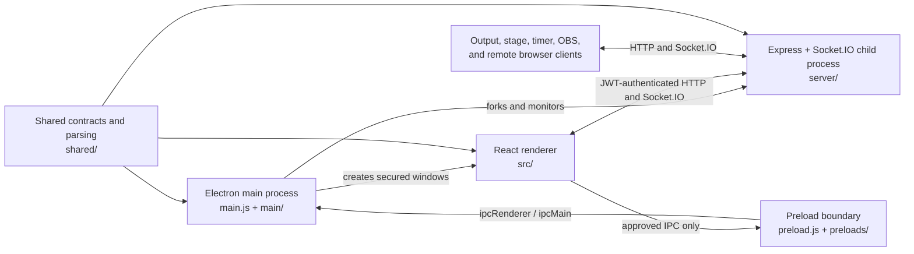

# Repository and Architecture Map

This is the contributor's map of LyricDisplay. Use it to identify the process that owns a behavior, find the first files to read, and understand which adjacent contracts must change with it.

For setup, code conventions, and pull request expectations, see [`CONTRIBUTING.md`](../CONTRIBUTING.md). HTTP and realtime protocol details live in [`openapi.yaml`](openapi.yaml) and [`asyncapi.yaml`](asyncapi.yaml).

## System at a Glance

LyricDisplay is one product with four runtime layers:



- The **Electron main process** owns native capabilities: windows, displays, filesystem dialogs, secure storage, update/install flows, MIDI/OSC, NDI companion management, and application lifecycle.
- The **preload layer** is the security boundary between browser code and Electron. Renderer code must use the APIs exposed on `window.electronAPI`; Node integration is disabled.
- The **React renderer** owns the control panel, editors, output views, local UI state, and client-side socket synchronization.
- The **backend** is the authoritative realtime session and network boundary. It authenticates clients, applies permissions and safety checks, stores live session state, serves media/API routes, and broadcasts state to displays.
- The **shared layer** contains environment-neutral parsing, limits, registries, reconciliation, and contract constants used by two or more runtime layers.

### Development and packaged topology

| Concern | Development | Packaged application |
| --- | --- | --- |
| Renderer URL | Vite on `http://localhost:5173` | Backend serves `dist/` on `http://127.0.0.1:4000` |
| Router | `BrowserRouter` | `HashRouter` |
| Backend | Electron forks `server/index.js` with `NODE_ENV=development` | Electron forks the unpacked backend with `NODE_ENV=production` |
| API/socket access | Vite proxies `/api`, `/socket.io`, and `/media` to port `4000`; Electron renderers resolve port `4000` directly | Same origin as the backend-served renderer |
| Native bridge | Electron windows only | Electron windows only |

The backend is a separate npm package with its own [`server/package.json`](../server/package.json) and lockfile. A clean checkout therefore needs both root and server dependencies installed. The optional `lyricdisplay-ndi/` directory is a separately cloned, ignored repository, not part of this repository's tracked tree.

## Top-Level Repository Map

```text
lyric-display-app/
|-- .github/                 # Funding metadata and release/platform-build workflows
|-- build/                   # Tracked electron-builder/installer resources (not build output)
|-- docs/                    # Architecture, API contracts, build, and recovery docs
|-- main/                    # Electron main-process implementation
|-- preloads/                # Restricted preloads for non-control windows
|-- public/                  # Static images, icons, backgrounds, and logos
|-- scripts/                 # Static checks, release/version, build metadata, protocol helpers
|-- server/                  # Express/Socket.IO backend (separate npm package)
|-- shared/                  # Cross-runtime contracts, parsing, validation, and bundled data
|-- src/                     # Vite/React renderer application
|-- tests/                   # Node test runner suites
|-- dist/                    # Generated renderer/package output; ignored
|-- uploads/                 # Development runtime media; ignored
|-- lyricdisplay-ndi/        # Optional ignored clone of the NDI companion repository
|-- index.html               # Vite HTML entry
|-- main.js                  # Electron main-process entry
|-- preload.js               # Full control-window preload API
|-- obs-dock.html            # Packaged OBS dock launcher page
|-- package.json             # Root scripts, dependencies, electron-builder config
|-- vite.config.js           # Vite build, aliases, worker format, and dev proxies
|-- tailwind.config.js       # Theme tokens, fonts, content scanning, plugins
|-- postcss.config.js        # Tailwind/PostCSS pipeline
|-- components.json          # shadcn-style UI component aliases
`-- jsconfig.json            # Editor alias for @/* -> src/*
```

Generated or machine-local paths are `node_modules/`, `server/node_modules/`, `dist/`, `release/`, `out/`, `uploads/`, logs, and the optional `lyricdisplay-ndi/` clone. The files inside `build/` are tracked packaging inputs and should be changed when installer behavior changes.

## Entry Points and Startup

### Electron startup

1. [`main.js`](../main.js) establishes app identity and the custom media scheme, takes the single-instance lock, initializes file logging, registers IPC, and wires protocol/file-open lifecycle events.
2. [`main/startup.js`](../main/startup.js) starts the backend, obtains the backend-generated admin key, prewarms providers/fonts, initializes display/NDI/external-control services, and creates the main window.
3. [`main/backend.js`](../main/backend.js) forks [`server/index.js`](../server/index.js), passes the user-data paths and app-session ID, waits for health readiness, mirrors logs, and applies bounded restart recovery.
4. [`main/windows.js`](../main/windows.js) creates secured `BrowserWindow` instances and loads either the Vite route or the backend-served hash route.
5. [`src/main.jsx`](../src/main.jsx) initializes the persisted Zustand store, chunk recovery, global styles, and the React root. [`src/App.jsx`](../src/App.jsx) selects the router and route tree.

Headless OBS Dock mode follows the same backend startup but deliberately skips creating renderer windows. Its relaunch/protocol behavior is owned by [`main/obsDockStartup.js`](../main/obsDockStartup.js), [`main/tray.js`](../main/tray.js), and the app-control backend route.

### Renderer routes

The source of truth is [`src/App.jsx`](../src/App.jsx). Custom output routes are bounded by [`shared/outputRegistry.js`](../shared/outputRegistry.js), currently `output3` through `output6` in addition to the two default outputs.

| Route | Main component | Runtime role |
| --- | --- | --- |
| `/` | `pages/ControlPanel.jsx` -> `components/LyricDisplayApp.jsx` | Primary operator UI; wrapped in the control socket provider and desktop shell when applicable |
| `/?dock=obs` and `/obs-dock` | `components/ObsDockLayout.jsx` | Compact OBS dock controller using an `obsDock` client identity |
| `/new-song` | `components/NewSongCanvas.jsx` | Lyrics authoring/editor workflow |
| `/lyric-video-studio` | `pages/LyricVideoStudio.jsx` | Timeline, preview, style, and export UI |
| `/output1`, `/output2` | `pages/Output1.jsx`, `pages/Output2.jsx` -> `pages/OutputPage.jsx` | Default socket-driven lyric outputs |
| `/output3` ... `/output6` | `pages/OutputPage.jsx` | Custom socket-driven lyric outputs |
| `/stage` | `pages/Stage.jsx` | Stage display: current/next/previous lyrics, timer, messages, upcoming song |
| `/time` | `pages/TimeDisplay.jsx` | Dedicated timer/clock projection |
| `/timer-control` | `components/TimerControlModule.jsx` | Dedicated authoritative timer controller |
| `/obs-setup` | `pages/ObsSetup.jsx` | OBS WebSocket/source creation UI |
| `/lyric-video-live-output` | `pages/LyricVideoLiveOutput.jsx` | Live visual output from the video studio state |
| `/lyric-video-export-frame` | `pages/LyricVideoExportFrame.jsx` | Capture-only export renderer with no preload |

Passive display routes skip the global modal/toast providers. Output, stage, time, and live-video windows receive the restricted passive preload; the export frame receives no preload. This policy is defined in [`main/windowSecurity.js`](../main/windowSecurity.js).

## Electron Main Process Map

### Orchestration, windows, and lifecycle

| File | Responsibility |
| --- | --- |
| [`main.js`](../main.js) | Composition root for lifecycle, IPC, menus, backend messages, single-instance behavior, tray behavior, protocol/file launches, and cleanup |
| [`main/startup.js`](../main/startup.js) | Ordered application startup and degraded backend-start handling |
| [`main/backend.js`](../main/backend.js) | Backend child-process lifecycle, readiness checks, IPC messages, log mirroring, restart policy |
| [`main/windows.js`](../main/windows.js) | BrowserWindow creation, route loading, navigation restrictions, crash recovery, window diagnostics |
| [`main/windowSecurity.js`](../main/windowSecurity.js) | Route-to-preload-role policy |
| [`main/singleInstance.js`](../main/singleInstance.js) | Single-instance lock and second-launch dispatch |
| [`main/fileHandler.js`](../main/fileHandler.js) | OS file association and pending-open handling |
| [`main/menuBridge.js`](../main/menuBridge.js) | Native menu construction and renderer menu events |
| [`main/modalBridge.js`](../main/modalBridge.js) | Promise-based requests from main process to renderer modals |
| [`main/tray.js`](../main/tray.js) | Desktop/headless system tray |
| [`main/cleanup.js`](../main/cleanup.js) | Central shutdown cleanup for backend, displays, external control, and NDI |
| [`main/paths.js`](../main/paths.js) | Development vs unpacked production path resolution |
| [`main/appIdentity.js`](../main/appIdentity.js) | Stable Electron app identity and user-data migration |

### Displays and projection

| File | Responsibility |
| --- | --- |
| [`main/displayManager.js`](../main/displayManager.js) | Electron display inventory, assignments, persistence, and moving windows to displays |
| [`main/displayDetection.js`](../main/displayDetection.js) | Display-add/remove detection and startup/user prompts |
| [`main/ipc/display.js`](../main/ipc/display.js) | Projection window creation/teardown, display queries, output and utility windows |
| [`main/loadingWindow.js`](../main/loadingWindow.js) | Restricted startup progress window |
| [`main/progressWindow.js`](../main/progressWindow.js) | Restricted update/download progress window |
| [`main/inAppBrowser.js`](../main/inAppBrowser.js) | Sandboxed in-app browser and URL/navigation IPC |

### IPC organization

[`main/ipc.js`](../main/ipc.js) is only a compatibility re-export. [`main/ipc/index.js`](../main/ipc/index.js) is the registration hub; domain ownership is below it.

| Domain file | Renderer capability |
| --- | --- |
| `app.js` | Theme, version/log paths, relaunch, OBS Dock startup |
| `auth.js` | Desktop JWT, join code, connection diagnostics, secure token store |
| `display.js` | Display inventory, projection, output/timer/OBS setup windows |
| `files.js` | Lyric open/save/parse and lyric-video audio grants |
| `recents.js` | Recent-file list and open behavior |
| `lyrics.js` | Online provider discovery, credentials, search, fetch, cancellation |
| `easyworship.js` | EasyWorship database validation and import |
| `presentation.js` | Presentation bundle validation and import |
| `setlist.js` | `.ldset` save/load/browse/export |
| `templates.js` | Output/stage template CRUD |
| `preferences.js` | Preference categories, migrations, defaults, and path browsing |
| `updater.js` | Check, download, install, session policy, progress window |
| `lyricVideoExport.js` | FFmpeg readiness/selection, frame capture, video export, cancellation |
| `security.js` | JWT status and rotation/restart |
| `window.js` | Window chrome, fullscreen, reload/devtools/zoom, undo/redo menu state |
| `misc.js` | Fonts, local IP, and in-app browser launch |
| `senderValidation.js` | Trusted sender/URL checks used to protect IPC and navigation |

When adding IPC, update all three surfaces: a domain handler in `main/ipc/` (or the owning integration module), the smallest appropriate preload API, and the renderer caller. Keep payload validation and sender validation in the main process.

### Native feature modules

| Area | Files |
| --- | --- |
| Preferences and local data | `userPreferences.js`, `preferenceMigrations.js`, `themePreferences.js`, `recents.js`, `userTemplates.js` |
| Secure data | `secureTokenStore.js`, `providerCredentials.js`, `adminKey.js` |
| Setlists/imports | `setlistFileStorage.js`, `setlistValidation.js`, `setlistExport.js`, `easyWorship.js`, `presentation.js` |
| Online lyrics | `lyricsProviders/index.js`, provider adapters under `lyricsProviders/providers/`, cache/reliability/search helpers alongside them |
| MIDI/OSC | `externalControl.js`, `externalControlCorrelation.js`, `midiController.js`, `oscController.js`, `oscSecurity.js` |
| NDI | `ndiManager.js` plus installer, IPC client, and settings modules under `main/ndi/` |
| Updates | `updater.js`, `updateSessionPolicy.js`, `progressWindow.js` |
| Diagnostics | `logging.js`, `batchedLogWriter.js`, `logRetention.js` |
| Lyric video | `lyricVideoMediaProtocol.js`, `ipc/lyricVideoExport.js` |
| Other OS integration | `systemFonts.js`, `obsDockStartup.js`, `devServer.js`, `utils.js` |

## Preload Security Boundary

[`preload.js`](../preload.js) exposes the full `window.electronAPI` used by control-capable windows. Its namespaces include token storage, lyric video, security, OBS Dock startup, window controls, recents, lyrics providers, EasyWorship, presentations, displays, setlists, templates, external control, MIDI, OSC, NDI, and preferences.

Restricted preloads in [`preloads/`](../preloads/) exist for narrow window roles:

| File | Allowed surface |
| --- | --- |
| `passive.cjs` | Token read, fullscreen toggle, preference reads for output/stage/time views |
| `browser.cjs` | In-app browser navigation only |
| `loading.cjs` | Startup status events only |
| `updater.cjs` | Updater state and actions only |

Do not import Node or Electron modules into `src/`. If renderer code needs a native operation, add a validated main-process handler and expose the minimum API required. Projection windows should not gain the full control preload without a deliberate security review.

## Backend Map

### Bootstrap and HTTP

[`server/index.js`](../server/index.js) creates secrets and token services, builds media paths, restores persisted session state, registers middleware/routes/socket authentication, optionally serves `dist/`, and sends readiness to Electron.

```text
server/
|-- auth/                    # JWT issuance/verification, permissions, join code, OBS pairing
|-- config/                  # Valid client type definitions
|-- media/                   # Upload validation, filenames, directories, media services
|-- middleware/              # CORS and loopback-only guards
|-- realtime/                # Authoritative state, persistence, safety, broadcasts, handlers
|-- routes/                  # Express route registration by domain
|-- security/                # Secret generation, rotation, keychain/encrypted fallback
|-- events.js                # Socket handler composition root
|-- index.js                 # Backend process entry
|-- package.json             # Backend-only dependencies/scripts
`-- package-lock.json        # Backend dependency lock
```

HTTP route ownership:

| Route module | Main endpoint family |
| --- | --- |
| `routes/auth.js` | `/api/auth/token`, refresh/validate, join code, OBS Dock token |
| `routes/outputs.js` | Output registry and per-output availability |
| `routes/integrations.js` | Integration/browser-source URLs |
| `routes/media.js` | Background uploads and user media list/upload/delete |
| `routes/templates.js` | Local template reads used by browser clients |
| `routes/connection.js` | Authenticated connected-client diagnostics |
| `routes/health.js` | Liveness, readiness, and privileged details |
| `routes/adminSecrets.js` | Local secret status/rotation |
| `routes/appControl.js` | Loopback desktop/dock mode switching and quit |

The exact public schemas belong in [`docs/openapi.yaml`](openapi.yaml). When changing an audited endpoint, also update [`shared/apiContractRegistry.js`](../shared/apiContractRegistry.js) and the contract tests/checker.

### Realtime ownership

[`server/events.js`](../server/events.js) is a composition root. Actual event logic lives in `server/realtime/handlers/`:

| Handler | Owns |
| --- | --- |
| `connectionHandlers.js` | Client registration, heartbeat, disconnect, current/periodic snapshots |
| `lyricsHandlers.js` | Line selection, lyric loads, timestamp/section grouping updates, filename and autoplay state |
| `outputHandlers.js` | Global/per-output toggles, styles, output registry, metrics, removal |
| `setlistHandlers.js` | Add/remove/update/load/clear/reorder/replace |
| `stageHandlers.js` | Authoritative timer changes and stage messages |
| `draftHandlers.js` | Remote lyric draft submit/approve/reject |
| `liveSafetyHandlers.js` | Live-safety state and blocking responses |
| `actionLogHandlers.js` | Privileged operator action-log snapshots and clear |

Supporting realtime modules:

| File | Responsibility |
| --- | --- |
| `state.js` | In-memory authoritative lyrics, selection, outputs, stage, timer, setlist, clients, drafts, registry, and safety state |
| `broadcast.js` | Permission/client-aware broadcast helpers |
| `sessionPersistence.js` | Debounced schema-versioned state snapshot and restore |
| `setlistValidation.js` | Size, shape, and count validation for socket setlist payloads |
| `timerScheduler.js` | Server-side timer boundary scheduling |
| `liveSafety.js` | Safety policy enforcement for mutating live actions |
| `actionLog.js` | Bounded audit history |
| `stateDiagnostics.js` | Health/diagnostic summaries without exposing sensitive state |
| `utils.js` | Plain-object, size, permission, and normalization helpers |

The backend accepts authenticated client types defined in `server/config/clientTypes.js`: desktop, web, OBS Dock, output clients, stage, and mobile. Permissions are assigned in `server/auth/permissions.js`; all mutating handlers must enforce the relevant permission and live-safety rule before changing state.

### Backend data and media

In Electron, [`main/backend.js`](../main/backend.js) sets `LYRICDISPLAY_DATA_DIR` to `<Electron userData>/backend`. The backend stores its realtime snapshot and uploaded media beneath that root. When `server/index.js` is launched directly without that environment variable, it falls back to the repository root, which is why development `uploads/` is ignored.

Authentication secrets prefer the OS keychain and use an encrypted platform config fallback. Renderer auth/provider tokens likewise prefer secure main-process storage. Never add secrets, admin keys, raw JWTs, or user-data paths to logs or socket payloads.

## Renderer Map

```text
src/
|-- assets/fonts/            # Bundled local fonts and licenses
|-- components/              # UI composition, feature components, bridges, primitives
|-- constants/               # Renderer-only UI/import/shortcut constants
|-- context/                 # Zustand store and control-socket/NDI providers
|-- hooks/                   # Behavior and integration hooks, grouped by feature when large
|-- integrations/            # OBS WebSocket and browser-source URL helpers
|-- lib/                     # Generic UI class-name helper
|-- pages/                   # Route-level screens and passive displays
|-- styles/                  # Font-face definitions
|-- utils/                   # Pure or renderer-scoped utilities
|-- workers/                 # Browser lyric parser worker
|-- App.jsx                  # Router, lazy route graph, global/passive provider split
|-- main.jsx                 # React bootstrap and store/chunk initialization
`-- index.css                # Global Tailwind/theme/application styles
```

### Components

- [`components/LyricDisplayApp.jsx`](../src/components/LyricDisplayApp.jsx) is the control-panel feature coordinator. Its extracted view pieces are in `components/LyricDisplayApp/`; orchestration behavior belongs in `hooks/LyricDisplayApp/`.
- [`components/LyricsList.jsx`](../src/components/LyricsList.jsx), `components/LyricsList/`, and `hooks/LyricsList/` own virtualized lyric rows, selection, grouping, history, context menus, and section navigation.
- [`components/NewSongCanvas.jsx`](../src/components/NewSongCanvas.jsx), `components/NewSongCanvas/`, and `hooks/NewSongCanvas/` own authoring, clipboard/history, search, measurements, timestamps, drafts, and saving.
- [`components/OutputSettingsPanel.jsx`](../src/components/OutputSettingsPanel.jsx), its directory, and `hooks/OutputSettingsPanel/` own output styling controls. Shared output rendering belongs in [`components/output/LyricVisualFrame.jsx`](../src/components/output/LyricVisualFrame.jsx).
- `components/LyricVideoStudio/` plus the lyric-video pages/utilities own preview, transport, timeline, styling, and export UX.
- `components/UserPreferencesModal/` and its hooks own preference editing; persistence itself crosses preload IPC into `main/userPreferences.js`.
- `components/routes/` decides which routes get the control socket provider and desktop shell.
- `components/bridges/` converts Electron events into renderer modals/actions without coupling feature components directly to raw IPC listeners.
- `components/modal/`, `components/toast/`, and `components/ui/` are reusable infrastructure. Add primitives here instead of cloning controls inside a feature.

### State ownership

[`src/context/LyricsStore.js`](../src/context/LyricsStore.js) composes a persisted Zustand store. Prefer the narrow selectors in [`src/hooks/useStoreSelectors.js`](../src/hooks/useStoreSelectors.js) rather than subscribing a component to the full store.

| Slice | Owns |
| --- | --- |
| `lyricsStore/lyricsSessionSlice.js` | Parsed/raw lyrics, selection, filename/source, sections, metadata, timestamps, pending saved version |
| `lyricsStore/outputSlice.js` | Master output state, default/custom output settings, enabled flags, custom output registry |
| `lyricsStore/stageSlice.js` | Stage enabled state and visual settings |
| `lyricsStore/timerSlice.js` | Timer controller settings and timer-display style settings |
| `lyricsStore/setlistSlice.js` | Setlist items, modal state, configurable item limit |
| `lyricsStore/autoplaySlice.js` | Autoplay defaults and onboarding state |
| `lyricsStore/preferencesSlice.js` | Renderer-facing formatting/tutorial/file-size preferences |
| `lyricsStore/appShellSlice.js` | Theme, welcome state, and desktop-runtime detection |

This store is both UI state and a local persistence cache. The backend remains authoritative for the connected live session. On first desktop connection, [`shared/sessionReconciliation.js`](../shared/sessionReconciliation.js) determines whether persisted desktop state may bootstrap an empty backend session; otherwise incoming backend snapshots win.

[`src/context/ControlSocketProvider.jsx`](../src/context/ControlSocketProvider.jsx) provides the long-lived controller socket and typed emitter helpers. [`src/hooks/useSocket.js`](../src/hooks/useSocket.js) is used by output/stage/time clients. Both delegate incoming state application to [`src/hooks/useSocketEvents.js`](../src/hooks/useSocketEvents.js) and connection throttling to [`src/utils/connectionManager.js`](../src/utils/connectionManager.js).

### Utility boundaries

- Put logic shared by Electron, server, worker, and renderer in `shared/`, not `src/utils/`.
- `src/utils/asyncLyricsParser.js` chooses Electron IPC, browser worker, or synchronous parsing based on runtime and format.
- `src/utils/parseLyrics.js`, `lyricsFormat.js`, `lyricLineNavigation.js`, and timestamp helpers adapt parsed lyric data for UI behavior.
- `src/utils/network.js`, `clientType.js`, `secureTokenStore.js`, and `connectionManager.js` own renderer network/auth connection details.
- `src/utils/maxLinesCalculator.js`, `paint.js`, `outputLabels.js`, and `outputTemplates.js` support output presentation/settings.
- `src/utils/timerUtils.js` supports renderer display/control calculations; authoritative validation/revision logic belongs in `shared/timerAuthority.js` and server realtime modules.
- `src/utils/logger.js` is the renderer logging facade. Keep sensitive values out of all log calls.

## Shared Modules Map

`shared/` must remain usable in its target environments. Avoid Electron, DOM, or Express imports here unless a file is explicitly environment-specific.

| File or directory | Responsibility |
| --- | --- |
| `lyricsParsing.js` | Compatibility barrel for the modular parser |
| `lyricsParsing/` | Text/LRC/online parsing, cleanup, grouping, translation, structure tags, sections, line splitting, runtime config |
| `lineSplitting.js` | Compatibility barrel for parser line-splitting exports |
| `documentTextExtraction.js` | Markdown/RTF/DOCX extraction and unified import parsing |
| `lyricImportRegistry.js` | Supported extensions, parser types, labels, accept strings, dialog filters |
| `lyricImportLimits.js` | Import and extracted-document size limits |
| `outputRegistry.js` | Default output IDs, custom-output count, routable IDs |
| `setlistLimits.js` | Setlist count, payload, item, and string limits |
| `timerAuthority.js` | Revisioned timer validation, clock localization, boundary advancement |
| `sessionReconciliation.js` | Desktop persisted-state vs backend-session bootstrap policy |
| `commandSafetyPolicy.js` | Focus/live-safety policy for operator commands |
| `apiContractRegistry.js` | Audited REST/realtime names and permissions |
| `productionReadiness.js` | Output, projection, and NDI pre-service health evaluation |
| `data/knownArtists.json` | Artist detection data |
| `data/openhymnal-*.json` | Bundled OpenHymnal provider data/sample |

If a limit, event name, output ID, timer shape, or parser behavior is consumed in multiple layers, define or normalize it here and import it at every boundary.

## Important Runtime Flows

### Load lyrics and cue a line

```text
file/online/setlist input
  -> renderer file/import hook
  -> asyncLyricsParser
       Electron: preload -> main/ipc/files.js -> shared parser
       Browser: Web Worker -> shared parser
       Fallback: shared parser in renderer
  -> Zustand lyrics session slice
  -> ControlSocketProvider emits lyricsLoad / lineUpdate
  -> server/realtime/handlers/lyricsHandlers.js validates and updates state.js
  -> server broadcasts role-appropriate state/events
  -> useSocketEvents updates each client store
  -> OutputPage or Stage renders the selected line
```

When changing this flow, check import limits/format registry, parser result shape, renderer store setters, socket payload validation, session persistence, and output/stage readers.

### Change an output style

```text
OutputSettingsPanel
  -> output selector/action in Zustand
  -> control socket styleUpdate
  -> outputHandlers.js validates output + permissions + live safety
  -> authoritative outputSettings map
  -> styleUpdate broadcast
  -> output client store
  -> LyricVisualFrame
  -> outputMetrics back to server/control panel
```

Style fields therefore have at least four consumers: defaults/state, settings controls, server synchronization, and visual rendering. Template serialization and pre-service readiness may be additional consumers.

### Project an output

```text
control panel action
  -> window.electronAPI.display
  -> main/ipc/display.js
  -> displayManager assignment
  -> windows.createWindow('/outputN', projection options)
  -> passive preload + output socket client
  -> metrics reported to the control panel
```

Projection changes should be checked on display reconnect/removal, custom-output deletion, crash recovery, fullscreen/focus behavior, and packaged hash routes.

### Authenticate and connect

```text
renderer client type + device/session ID
  -> useAuth / secure token store
  -> /api/auth token, refresh, or OBS pairing route
  -> signed JWT with client permissions
  -> Socket.IO auth middleware
  -> connectionHandlers client registration
  -> role-filtered currentState snapshot
```

Desktop credentials cross from backend child to Electron over process IPC and are never sent to arbitrary browser clients. Web/mobile controllers use the join-code flow; OBS Dock has pairing/local-headless flows. Output/stage clients receive read-oriented permissions.

## Where to Make a Change

| Feature | Start here | Usually inspect/update too |
| --- | --- | --- |
| Add an import format | `shared/lyricImportRegistry.js`, `shared/documentTextExtraction.js` | import limits, `main/ipc/files.js`, async parser, file associations in `package.json`, tests |
| Change lyric parsing/grouping | `shared/lyricsParsing/` | worker/async parser, user parsing preferences, parsing/import tests |
| Change lyric selection/cueing | `LyricsList` hooks/components | control emitters, `lyricsHandlers.js`, output/stage readers, command safety |
| Add/change an output setting | `lyricsStore/outputSlice.js`, `OutputSettingsPanel` | control hooks, `outputHandlers.js`, `LyricVisualFrame.jsx`, templates, tests |
| Change output count/IDs | `shared/outputRegistry.js` | routes, output store, server state/handlers, display IPC, NDI registration, contracts/tests |
| Change stage display | `pages/Stage.jsx`, `StageSettingsPanel.jsx` | stage slice, stage handlers, timer/messages, templates |
| Change timer behavior | `TimerControlModule.jsx`, `shared/timerAuthority.js` | timer slice/utils, stage handlers/scheduler, Stage/TimeDisplay, timer tests |
| Change setlists | `SetlistModal.jsx`, setlist hooks | shared limits, server handler/validation, main `.ldset` storage/export, tests |
| Add an online lyrics provider | `main/lyricsProviders/providers/` | provider index/reliability/search, IPC lyrics handler, search modal, provider tests/logos |
| Change background/user media | output settings/media modal | server routes/media services, URL resolver/rendering, auth permissions, media tests |
| Change auth/permissions | `server/auth/` | renderer auth/token store, preload/main secure storage, docs contracts, security tests |
| Add Electron-native behavior | owning module under `main/` | IPC domain, preload API, renderer caller, sender/preload boundary tests |
| Change displays/projection | `main/ipc/display.js`, `main/displayManager.js` | window security/recovery, renderer output metrics, display tests |
| Change MIDI/OSC | `main/externalControl.js` and controllers | preferences UI/hooks, command safety/correlation, OSC security tests |
| Change NDI | `main/ndiManager.js`, `main/ndi/` | renderer NDI store/bridges/modals, output registry/settings, companion repository contract/tests |
| Change OBS integration | `src/integrations/obs/`, `pages/ObsSetup.jsx` | integration route URLs, OBS Dock route/startup, app-control routes |
| Change lyric video export | video studio components/pages | video utilities, media protocol, export IPC, preload surface, timeline tests |
| Change preferences | `main/userPreferences.js` | migrations, preference IPC/preload, renderer loaders/slices/modal hooks |
| Change updater/release | `main/updater.js` | IPC/preload bridges, session policy, electron-builder config, scripts/workflows/recovery doc |

## API and Contract Discipline

- Realtime implementation lives in `server/realtime/handlers/`, not in the `server/events.js` composition file.
- Keep event payload changes aligned across controller emitters, server validation/state, receiver handlers, session snapshots, and [`docs/asyncapi.yaml`](asyncapi.yaml).
- Keep REST changes aligned across the route, caller, authentication middleware, [`docs/openapi.yaml`](openapi.yaml), and audited registry where applicable.
- Preserve role-filtered state in `server/realtime/state.js`; output/stage clients should not receive control-only or sensitive session data.
- Avoid introducing a second constant for a cross-layer limit or identifier. Move the source of truth into `shared/`.

## Tests, Checks, and Release Files

The project uses Node's built-in test runner. Test filenames generally mirror their owning module or contract.

| Change area | Useful checks |
| --- | --- |
| Any source change | `npm run check:static`, `npm run test:unit` |
| REST/realtime contract | `npm run check:contracts`, `tests/api-contracts.test.js` |
| Parsing/imports/providers | parsing/import/provider/search tests; optional `npm run test:lyrics-canary` makes live provider requests |
| Auth/IPC/preload/security | auth, information-exposure, IPC sender, preload-boundary, secret-storage, security-hardening tests |
| Outputs/displays/session | display-recovery, setlist-output-state, session-reconciliation, state-diagnostics tests |
| Timer | timer-authority and timer-utils tests |
| NDI/external control | NDI installer/client/settings/CLI, external-control, OSC security tests |
| Renderer/package integration | `npm run build`; package workflows under `.github/workflows/` |

[`scripts/check-static.js`](../scripts/check-static.js) checks syntax/import hygiene and invokes API contract validation. Other scripts write build metadata, update versions/docs, verify update blockmaps, register the development protocol, and drive releases. Tag-based multi-platform release behavior is defined in [`.github/workflows/build-release.yml`](../.github/workflows/build-release.yml); manual packaging verification is in `test-platform-builds.yml`.

Documentation-only changes do not require starting a dev server. For behavior changes, use the narrowest relevant checks first, then the root static/unit suite and production renderer build before handoff.

## Keeping This Map Current

Update this document when a change:

- adds, removes, or relocates an entry point, route, domain folder, or process boundary;
- moves authoritative state or persistence ownership;
- introduces a new IPC, HTTP, Socket.IO, protocol, or companion-app surface;
- adds a cross-layer source of truth under `shared/`;
- changes generated, runtime, tracked packaging, or separately cloned directories; or
- changes the recommended first files for a feature area.

The map should describe current code ownership. User-facing setup belongs in [`INSTALLATION.md`](../INSTALLATION.md), contribution policy belongs in [`CONTRIBUTING.md`](../CONTRIBUTING.md), and wire-level schemas belong in the OpenAPI/AsyncAPI documents.
